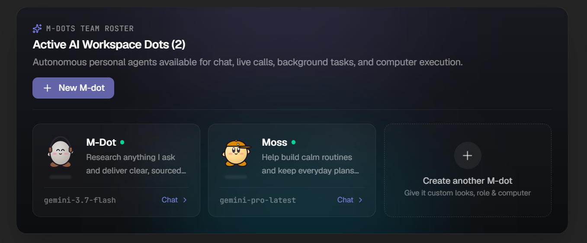

<div align="center">
  
</div>

<br />

# Maxdots (M-dots)

Maxdots is an open-source enterprise workspace for personal AI agents ("dots") that have their own computers, persistent storage, browser automation, and voice capabilities.

Inspired by the dark-theme aesthetics and collaboration mechanics of modern team platforms, Maxdots allows you to configure, manage, and collaborate with autonomous AI agents across chat, voice calls, channels, and automated workflows.

---

## 🌟 Key Features

### 🎨 User-Friendly & Intuitive UI
- **Interactive Moveable Dots Canvas**: An interactive visual playground in the Settings banner where your M-dots live on a moveable canvas—drag them around freely, and hover over any dot to reveal quick edit and delete action buttons.
- **Clean, Clutter-Free Views**: Thoughtful minimalism throughout the app—such as the streamlined Calls section that shows only the essential dot name and call icon for one-click calling without visual clutter.
- **Persistent Floating Voice Bar**: Spoken voice calls remain active in a sleek, non-intrusive floating bar at the bottom of the screen while you freely navigate between chats, channels, tools, and settings.
- **Live Split-Pane Computer Monitor**: Watch your AI agents execute tasks in real time with side-by-side terminal output, live browser interaction previews, and file trees directly next to your chat.
- **Visual Human-in-the-Loop Approval Cards**: Review sensitive file modifications, bash commands, and external actions with crystal-clear diff previews and instant one-click "Approve" or "Reject" buttons.
- **Global Command Palette (`Ctrl + K`)**: Swiftly jump to any dot, channel, workflow, or setting with full keyboard navigation and shortcut support.
- **Tailored Modern Dark Theme**: Built with eye comfort and aesthetics in mind, featuring high-contrast dark surfaces, smooth micro-interactions, and responsive layouts for both web and desktop.

### 🤖 Autonomous AI Agents ("Dots")
- **Customizable 3D Avatars**: Built with Three.js and React Three Fiber, each dot features responsive poses, animations (idle, working, waiting, sleeping), custom colors, and accessories.
- **Persona & Reaction Styles**: Tune how dots speak and respond (Cute or Professional), with dedicated instructions and tool permissions.
- **Personalized Workspaces**: Each dot gets its own persistent working environment and memory across chats and tasks.

### 💻 Computer Use & Sandbox Environments
- **E2B Cloud Desktops**: Seamless integration with E2B (`@e2b/desktop`) for sandboxed cloud virtual machines that stay running even when your PC sleeps.
- **Local Docker Containers**: Run tasks in isolated Linux containers (`node:22-bookworm` or custom images) with dedicated workspaces.
- **Local PC Sandbox**: Safe local directory execution gated by approval cards.
- **Autonomous Web Browser**: Built-in Playwright/Chromium engine allowing dots to browse websites, navigate web apps, and complete online workflows.

### 📞 Live Voice Calling & Calls Section
- **Dual Voice Engines (Google Gemini & OpenAI Realtime)**: Call any dot using Google Gemini voice models (e.g. `gemini-2.0-flash` or Vertex AI) or OpenAI Realtime over WebRTC with automatic fallback.
- **Natural Spoken Turn-Taking**: Fluid conversational audio with browser speech recognition and high-fidelity speech synthesis.
- **Background Task Handoff**: Dots take instructions by voice, dispatch autonomous computer tasks in the background (`send_task`), and speak work updates out loud as results finish.
- **Persistent Floating Voice Panel**: Voice calls survive across page navigations within the workspace.
- **Teams-Grade Calls Hub**: Dedicated calls interface with Speed Dial, Contacts, Call History tracking, quick dialer, and voice engine selector.

### 👥 Channels & Multi-Agent Collaboration
- **Teams & Channels**: Organize conversations into topic-based channels where multiple dots can collaborate together.
- **Approval Cards & Checkpoints**: Safe human-in-the-loop controls for file access, tool execution, and external actions.

### 🔌 Integrations & App Ecosystem
- **Composio Integration**: Connect to hundreds of enterprise tools (Google Calendar, GitHub, Slack, Notion, Jira, etc.) with instant OAuth and managed triggers.
- **Model Context Protocol (MCP)**: Native support for MCP servers and tools (`@modelcontextprotocol/sdk`).

---

## ⚖️ Comparison: M-dots vs. OpenAI Agents vs. Grok Bots

| Feature / Capability | 🟣 **M-dots (Maxdots)** | 🟢 **OpenAI Agents / Custom GPTs** | ⚪ **Grok Bots (xAI)** |
|---|---|---|---|
| **Ecosystem & Ownership** | **100% Open Source & Self-Hosted**<br>Full data and workspace ownership | **Closed SaaS Platform**<br>Vendor-locked to OpenAI cloud | **Closed SaaS Platform**<br>Vendor-locked to xAI ecosystem |
| **Model Freedom** | **Multi-Model Freedom**<br>Google Gemini, OpenAI, Vertex AI, OpenRouter | **OpenAI Only**<br>GPT-4o, o1, o3-mini | **Grok Only**<br>Grok-2, Grok-3 |
| **Agent Computers & Sandboxes** | **Dedicated Virtual Computers**<br>E2B Cloud Desktops, Local Docker Containers, & Local PC Sandboxes | **Code Interpreter Only**<br>Ephemeral Python sandbox, no full OS computer | **No Full OS Computer**<br>Static code evaluation only |
| **Web Browser Automation** | **Built-in Playwright / Chromium**<br>Autonomous web navigation, logins, downloads, and interactive tasks | **Operator / Browser Tool**<br>(Gated enterprise access, cloud hosted) | **Basic Web Search**<br>Text-only search results retrieval |
| **Live Voice Communication** | **Dual Voice Engine**<br>Google Gemini Voice + OpenAI Realtime WebRTC with automatic fallback | **Realtime API / Voice Mode**<br>OpenAI proprietary audio endpoints only | **Basic Spoken Output**<br>Text-to-speech audio streaming |
| **Teams & Multi-Agent Collaboration** | **Native Teams Channels**<br>Topic channels where multiple dots converse, coordinate, and delegate work | **Single 1:1 Chats**<br>No native channel collaboration between multiple agents | **Single 1:1 Chats**<br>Single bot conversations on X/web |
| **Visual Identity & Avatars** | **Interactive 3D Puffball Avatars**<br>Real-time Three.js characters with custom shapes, poses, and accessories | **Static 2D Images**<br>Flat avatar circle picture | **Static 2D Images**<br>Flat Grok profile icon |
| **Third-Party Integrations** | **Composio (100+ Enterprise Apps) & MCP**<br>Gmail, GitHub, Google Calendar, Slack, Notion, Jira, custom MCP servers | **Custom Actions (OpenAPI)**<br>Manual schema setup required | **X / Twitter API Integrations**<br>Primarily tied to X platform data |
| **Security & Human-in-the-Loop** | **Interactive Approval Cards**<br>Granular confirmation cards for files, bash commands, and external actions | **Basic Confirmation Popups**<br>Limited interactive workflow states | **Standard Warning Prompts**<br>No granular workflow cards |
| **User Experience & UI Design** | **User-Friendly Interactive UI**<br>Moveable dots canvas, 3D animated avatars, floating persistent voice call bar, minimalist views, split computer pane | **Standard Chat Interface**<br>Traditional message stream with basic sidebar | **Standard Chat Interface**<br>Minimal message stream on X platform |
| **Data Privacy & Storage** | **Local SQLite + Keychain AES-256**<br>Passwords and chat history remain on your machine | **Cloud Hosted**<br>Data stored on OpenAI servers | **Cloud Hosted**<br>Data stored on xAI servers |

---

## 🛠️ Technology Stack

| Layer | Technologies |
|---|---|
| **Framework** | Next.js 16 (App Router), React 19, TypeScript |
| **Styling** | Tailwind CSS 4, CSS Variables, Lucide Icons |
| **3D Rendering** | Three.js, React Three Fiber (`@react-three/fiber`), Drei (`@react-three/drei`) |
| **Desktop App** | Electron 44, Electron Builder |
| **Agent Runtimes** | OpenAI SDK, Google GenAI / Vertex AI, OpenRouter |
| **Sandboxes** | E2B Desktop (`@e2b/desktop`), Docker, Playwright Chromium |
| **Tool Ecosystem** | Composio Core (`@composio/core`), Model Context Protocol (MCP) |

---

## 🚀 Getting Started

### Prerequisites
- **Node.js**: `v20.x` or `v22.x` recommended
- **Package Manager**: `pnpm` (recommended), `npm`, or `yarn`
- **Optional**: Docker (for containerized sandboxes) or an [E2B API key](https://e2b.dev) (for cloud sandboxes)

### 1. Clone & Install Dependencies

```bash
git clone https://github.com/MaxMasAI/Maxdots.git
cd Maxdots
pnpm install
```

### 2. Configure Credentials (In-App Key Input or Environment)

Maxdots offers two ways to provide credentials:

#### 🔑 In-App Key Input & Save (Recommended)
You don't need to manually edit configuration files. Simply open the app and go to **Settings → Devices and models**:
- **Key Input Field**: Paste your key directly into the secure input box (`sk-...`, `AIza...`, `sk-or-...`, or `e2b_...`).
- **Live Validation & Instant Save**: Click **Save**—Maxdots checks key validity with the provider, securely stores it encrypted (AES-256), and immediately connects your models.
- **Easy Override & Remove**: You can click **Override Key** or **Change** at any time to update keys without restarting the application.

#### ⚙️ Environment Variables (`.env.local`)
Alternatively, copy the example environment file and configure your API keys:

```bash
cp .env.example .env.local
```

Edit `.env.local` with your preferred AI provider:

```ini
# Add at least one AI provider key:
OPENAI_API_KEY=sk-...
# GEMINI_API_KEY=AIza...
# OPENROUTER_API_KEY=sk-or-...

# Optional Cloud Sandbox (E2B)
# E2B_API_KEY=e2b_...

# Optional Integrations (Composio)
# COMPOSIO_API_KEY=ak_...

# Server URL
DOTS_PUBLIC_URL=http://localhost:3100
```

### 3. Run the Development Server

```bash
pnpm dev
```

Open [http://localhost:3100](http://localhost:3100) in your browser.

---

## ☁️ Model Providers & Credentials

Maxdots supports multiple LLM providers:

### OpenAI
Provide an `OPENAI_API_KEY` in `.env.local` or through **Settings → Devices and models**.
- Supports GPT-4o, GPT-5 series, and Realtime WebRTC voice (`gpt-realtime-2.1`).

### Google Gemini & Vertex AI
You can use Gemini models directly with an API key (`GEMINI_API_KEY`) or through Google Cloud Vertex AI:
1. Open **Settings → Devices and models** and enter your Google Cloud Project ID and Location.
2. Authenticate via Application Default Credentials:
   ```bash
   gcloud auth application-default login
   ```
   Or set environment variables in `.env.local`:
   ```ini
   VERTEX_AI_PROJECT=your-project-id
   VERTEX_AI_LOCATION=us-central1
   GOOGLE_APPLICATION_CREDENTIALS=/path/to/service-account.json
   ```

### OpenRouter
Provide `OPENROUTER_API_KEY` to access open-source models (DeepSeek, Qwen, GLM, Llama, Kimi, etc.).

---

## 📦 Project Structure

```text
Maxdots/
├── build/                 # Desktop and build resources (icons, assets)
├── electron/              # Electron main process and configuration
├── public/                # Static assets, branding, and illustrations
│   ├── logo_head_transparent.png  # Brand logo
│   └── calls_empty_illustration.jpg # 3D Calls empty state artwork
├── scripts/               # Desktop build and preparation scripts
└── src/
    ├── app/               # Next.js App Router pages & server actions
    │   ├── api/           # API routes (events, completions, voice)
    │   ├── apps/          # Apps and plugins directory
    │   ├── calls/         # Calls section & history view
    │   ├── channels/      # Teams and collaborative channels
    │   ├── dots/          # Individual dot chat & computer views
    │   ├── settings/      # Workspace, models, and security settings
    │   ├── actions.ts     # Server actions
    │   ├── globals.css    # High-contrast dark theme & tokens
    │   └── layout.tsx     # Root layout with sidebar and status bars
    ├── components/        # UI components
    │   ├── CallsView.tsx  # Teams-inspired Calls interface
    │   ├── Chat.tsx       # Message list, composer, approval cards
    │   ├── ComputerPane.tsx # Sandbox monitor & remote desktop
    │   ├── Dot3D.tsx      # 3D puffball avatar renderer & accessories
    │   ├── DotOrb.tsx     # 2D SVG avatar orb with live status
    │   ├── LookEditor.tsx # Interactive avatar visual customizer
    │   ├── MobileBar.tsx  # Top navigation bar with global search
    │   ├── Sidebar.tsx    # Left rail & collapsible navigation
    │   └── VoicePanel.tsx # Live WebRTC call panel
    ├── lib/               # Client stores, voice caller, and utilities
    └── server/            # Backend agent loop, tools, and sandboxes
```

---

## 🖥️ Desktop App (Electron)

Maxdots can be run as a standalone desktop application on macOS and Windows:

```bash
# Run Electron in development mode
pnpm desktop:dev

# Build standalone desktop installer for Windows (.exe / NSIS)
pnpm desktop:build:win

# Build desktop package for macOS (.dmg)
pnpm desktop:build
```

---

## ⌨️ Useful Keyboard Shortcuts

| Shortcut | Description |
|---|---|
| `Ctrl + K` / `Ctrl + E` | Focus global search bar |
| `Ctrl + .` | Open keyboard shortcuts dialog |
| `Ctrl + /` | Open command palette |
| `Ctrl + ,` | Open Settings |
| `Ctrl + 1` | Chat home |
| `Ctrl + 3` | Channels & Teams |
| `Ctrl + 4` | Apps directory |
| `Ctrl + 5` | Calls section |
| `Esc` | Close search dropdowns or modals |

---

## 📄 License

This project is licensed under the Apache 2.0 License. See the [LICENSE](LICENSE) file for details.